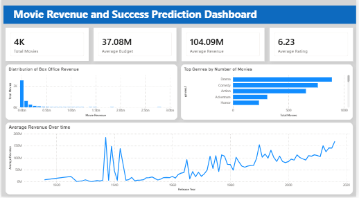
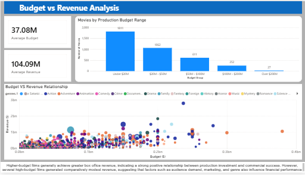
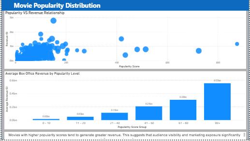
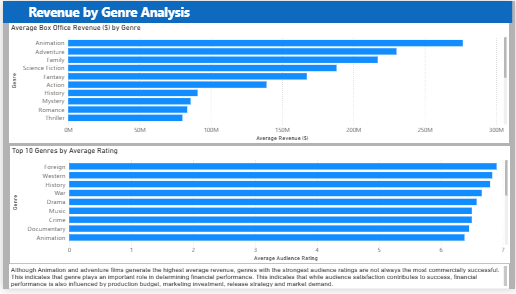
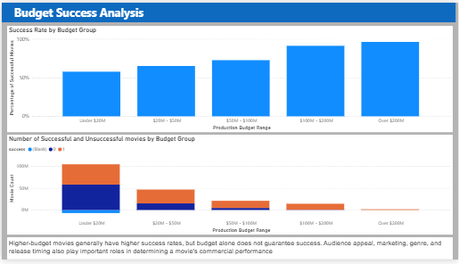

# Project Overview

This project analyses movie data from the TMDB (The Movie Database) dataset to identify the key factors that influence movie revenue and commercial success. The project combines data cleaning, exploratory data analysis, statistical hypothesis testing, machine learning, and interactive business intelligence dashboards to generate meaningful insights that support data-driven decision-making within the film industry.

Using Python for data preparation and statistical analysis, and Power BI for dashboard development, the project investigates how factors such as production budget, popularity, audience ratings, and genre influence box office performance. A machine learning classification model was also developed to predict whether a movie is likely to be commercially successful.

# 

# Dataset Content

**TMDB Movie Metadata Dataset**
Source: Kaggle

[TMDB Movie Metadata Dataset](https://www.kaggle.com/datasets/tmdb/tmdb-movie-metadata?utm_source=chatgpt.com)

The dataset contains information about thousands of movies, including:

* Movie title and release date
* Budget and revenue
* Popularity score
* Runtime
* Average ratings and vote counts
* Genres
* Cast and crew information

The dataset consists of two main files:

* **tmdb_5000_movies.csv** – contains movie metadata such as revenue, budget, popularity and ratings
* **tmdb_5000_credits.csv** – contains information about movie cast and crew

These datasets were merged during the ETL process to create a unified dataset for analysis.

# Business Requirements

The goal of this project is to analyse movie industry data to understand the factors that influence movie success and revenue, and to develop a predictive model capable of estimating movie success.

The specific business requirements are:

* Identify key factors that influence movie revenue and success.
* Analyse relationships between movie budget, popularity, ratings, and revenue.
* Perform statistical testing to validate relationships between variables.
* Develop a machine learning model capable of predicting whether a movie will be successful.
* Present insights through visualisations and an interactive dashboard.
* Provide a dashboard that allows users to explore trends in movie performance.

This project seeks to answer the following business questions:

* Does increasing a movie's production budget lead to higher revenue?
* Does movie popularity influence financial success?
* Which genres generate the highest average box office revenue?
* Can historical movie characteristics be used to predict commercial success?

# Hypothesis and How to Validate

### Hypothesis 1

Movies with higher budgets tend to generate higher revenue.

**Validation Method:**
A **Pearson correlation test** is used to determine whether there is a statistically significant relationship between movie budget and revenue.

### Hypothesis 2

Movies with higher popularity scores tend to generate higher revenue.

**Validation Method:**
A **Pearson correlation test** is used to evaluate the relationship between popularity and revenue.

### Hypothesis 3

Average revenue differs between movie genres.

**Validation Method:**
An **ANOVA (Analysis of Variance) test** is used to compare the average revenue across different genres to determine whether the differences are statistically significant.

# Project Plan

The project followed a structured data analytics workflow consisting of:

* **Data Collection** – The TMDB movie dataset was obtained from Kaggle.
* **Data Cleaning and Transformation** – The data was cleaned, formatted, and merged.
* **Exploratory Data Analysis (EDA)** – Patterns and relationships in the dataset were explored.
* **Data Visualisation** – Graphical representations were created to communicate insights.
* **Statistical Testing** – Hypothesis testing was performed to validate findings.
* **Machine Learning** – Predictive models were developed to estimate movie success.
* **Dashboard Development** – A visual dashboard was created to allow interactive exploration of the dataset.

# Data Management

Data was managed through the following stages:

**Collection**
The dataset was downloaded from Kaggle and stored in the project’s `dataset` folder.

**Processing**
Data cleaning and transformations were performed during the ETL stage. The two CSV files were merged and missing or inconsistent values were addressed.

**Analysis**
The cleaned dataset was analysed using exploratory data analysis and statistical testing.

**Interpretation**
Insights derived from the analysis were visualised through charts and dashboards.

The processed dataset was saved as: tmdb_processed.csv

This ensures reproducibility and consistency for analysis and modelling.

# Research Methodologies Used

The following methodologies were used in the project:

* **Exploratory Data Analysis (EDA)** to understand the structure and patterns in the dataset.
* **Statistical Hypothesis Testing** to validate relationships between variables.
* **Machine Learning Classification Models** to predict movie success.

These methodologies were selected because they provide both **descriptive insights and predictive capabilities**, which are valuable for analysing industry trends and supporting decision-making.

# Analysis Techniques Used

The following techniques were used:

**Exploratory Data Analysis**
Used to examine distributions, identify outliers, and understand relationships between variables.

**Data Visualisation**
Charts and plots were used to illustrate relationships between budget, revenue, popularity, and genre.

**Statistical Testing**
Correlation tests, ANOVA tests and Chi-Square Tests were used to determine whether observed patterns were statistically significant.

**Machine Learning**
A classification model was trained to predict whether a movie would be financially successful.

The analysis followed this structure:

1. Data cleaning and transformation
2. Exploratory data analysis
3. Visualisation of trends and relationships
4. Statistical validation
5. Predictive modelling

This approach ensures that insights are validated before predictive models are built.

# Data Limitations

Some limitations of the dataset include:

* Limited information about **marketing budgets and promotional campaigns**
* Missing contextual variables such as **critical reviews or audience sentiment**
* Possible skewness due to blockbuster movies generating extremely high revenue

Alternative approaches could include:

* Using more advanced models such as **Gradient Boosting or XGBoost**
* Applying **feature engineering techniques**
* Incorporating additional movie datasets for broader analysis

# Generative AI Usage

Generative AI tools were used to assist with:

* Project planning and structuring the workflow
* Debugging and improving Python scripts
* Suggesting statistical analysis approaches
* Structuring documentation and explanations
* Assisting with dashboard design ideas

AI tools were used as **supporting tools**, while the final implementation, validation, and interpretation of results were completed independently.

# Ethical, Legal and Social Considerations
**Ethical Consideration**

The TMDB dataset used in this project is publicly available and contains information about movies rather than individuals. As a result, no personal or sensitive data was processed during the analysis. The primary ethical consideration was ensuring that the data was cleaned consistently and that the findings accurately represented the dataset without exaggerating or misinterpreting relationships between variables.

Generative AI was used to support project planning, debugging, documentation and dashboard design. However, every AI-generated suggestion was independently reviewed, tested against the dataset and adapted where necessary. This ensured that all statistical analyses, visualisations and business conclusions reflected the actual project outputs rather than AI-generated assumptions.

**Legal Considerations**

The dataset was obtained from Kaggle and is publicly available for educational purposes. No personally identifiable information (PII) was collected, stored or processed, meaning the project did not involve handling data subject to UK GDPR requirements.

Although personal data was not involved, good data management practices were followed throughout the project. Raw and processed datasets were maintained separately, all transformation steps were documented, and version control was implemented using Git and GitHub to ensure transparency, traceability and reproducibility of the analysis.

**Social Implications of the Findings**

The analysis identified positive relationships between production budget, popularity and movie revenue. While these findings provide useful business insights, they should not be interpreted as guarantees of future commercial success. Movie performance is influenced by many additional factors—including marketing strategy, release timing, competition, audience preferences and wider economic conditions—that were not included in the dataset.

An organisation relying solely on these findings could prioritise investment only in historically successful genres or high-budget productions, potentially overlooking innovative ideas, independent films or emerging market trends. Therefore, the dashboard and predictive model should be used to support decision-making alongside market research, creative expertise and business judgement rather than as the sole basis for investment decisions.

**Data Governance and Transparency**

Throughout the project, good data governance practices were followed to ensure that the analysis was transparent and reproducible. Raw and processed datasets were stored separately, all data cleaning and transformation steps were documented within the Jupyter notebooks, and the complete project was managed using Git and GitHub. These practices allow other analysts to reproduce the workflow, verify the findings and understand how conclusions were reached.

**Responsible Use of Machine Learning**

The predictive model developed in this project is intended for **educational and analytical purposes**. It should not be used as a definitive tool for predicting movie success in real-world business decisions without further validation, additional data sources, and more sophisticated modelling.

# Dashboard Design

The dashboard was created using **Power BI** to present key insights from the dataset in an interactive and accessible way.

The dashboard is structured into five main pages:

## Overview Page

Purpose: Provide a high-level overview of the movie dataset.

## Budget and Revenue Page

Purpose: Analyse the relationship between movie production budgets and box office revenue to understand whether higher investment leads to higher financial returns.

## Movie Popularity Distribution Page

Purpose: Explore how movie popularity influences financial success.

## Revenue by Genre Analysis Page

Purpose: Investigate how movie revenue varies across different genres and understand genre distribution in the dataset. 

## Budegt Success Analysis

Purpose: Evaluate whether movie success is associated with production budget levels.

## Key Findings
* Budget positively influences revenue.
* Popularity strongly contributes to commercial success.
* Adventure and Animation produce the highest average revenues.
* Audience ratings alone do not guarantee financial success.

## Business Recommendations
* Prioritise investment in commercially successful genres.
* Allocate production budgets strategically.
* Invest in marketing to improve movie popularity.
* Combine financial, audience and creative factors when making production decisions.

# Challenges

Several challenges were encountered during the development of the project.

One challenge involved **cleaning and merging the two datasets** (`movies` and `credits`). The structure of the credits dataset required additional processing to integrate it effectively with the movie metadata.

Another significant challenge encountered was working with the genres column. Rather than containing plain text values, each record stored genre information as a list of dictionaries in JSON format. This required additional preprocessing to extract the genre names before the data could be analysed.

After extracting the genre names, many movies were found to belong to multiple genres, resulting in several genre values being stored within a single cell. This made the data difficult to aggregate and visualise, as Power BI treated each unique genre combination as a separate category rather than recognising individual genres. To overcome this, the genre data was transformed into a more analysis-friendly structure, enabling meaningful comparisons of revenue and ratings across genres.

Another challenge was **handling skewed revenue data**, where a small number of blockbuster movies significantly influenced statistical measures such as the mean.

It was also challenging to **select the most relevant features for machine learning**, as many variables in the dataset were either categorical or nested in JSON format. I also tried to edit the genre column in Power BI to contain only name (without ID) but kept getting errors which i didn't have enough time to resolve.

# What Went Right

Several aspects of the project worked well.

The **ETL process successfully merged and cleaned the datasets**, allowing for consistent analysis.

The **EDA stage revealed clear relationships between budget, popularity, and revenue**, which helped guide the hypothesis testing and modelling phases.

The **visualisations and dashboard effectively communicated insights**, making it easier to interpret complex data patterns.

# What Went Wrong

Some issues arose during the project.

Some columns contained **nested JSON structures**, which required additional preprocessing to make them usable.

The dataset also contained **outliers in revenue values**, which influenced summary statistics and required careful interpretation.

Additionally, some early visualisations were difficult to interpret until variables were transformed or grouped into more meaningful categories.

These challenges helped highlight the importance of **data cleaning, feature engineering, and careful interpretation of results**.

# Deployment

The dashboard was developed using **Power BI Desktop** and exported for presentation.

# Main Data Analysis Libraries

**Pandas** – Data loading and manipulation
Example:

df = pd.read_csv("dataset/processed_movies.csv")

**NumPy** – Numerical calculations and statistical operations.
**Matplotlib and Seaborn** – Data visualisation.
**Scikit-learn** – Machine learning model training and evaluation.

# Learning Journey

This project provided valuable hands-on experience in building a complete data analytics workflow from raw data to insight generation and predictive modelling.

During the project, I strengthened my understanding of the **ETL process**, data cleaning, and feature engineering using Python libraries such as Pandas and NumPy. I also gained experience applying **statistical analysis and hypothesis testing** to validate relationships within the dataset.

Another important aspect of the project was building an **interactive dashboard** that communicates analytical findings in a clear and accessible way. This emphasised the importance of presenting technical insights in a format that can be understood by both technical and non-technical audiences. 

Overall, the project improved my confidence in developing a structured analytics project while highlighting the importance of **data preparation, visual storytelling, and responsible interpretation of results**.

# Credits

Dataset sourced from:

* TMDB Movie Metadata Dataset (Kaggle)

Learning materials:

* LMS

Generative AI tools used:

* ChatGPT
* GitHub Copilot

# Acknowledgements

Many thanks to **Vasi, Mark, and my colleagues** for their support and guidance during the completion of this project.
